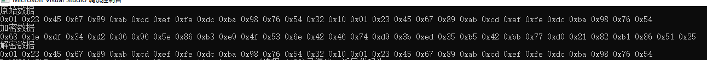

# sm4
国密算法sm4

```c++
#include <iostream>
#include <iomanip>
#include "sms4.h"

int main()
{
	UCHAR plain_text[30] = {0x01,0x23,0x45,0x67,0x89,0xab,0xcd,0xef,0xfe,0xdc,0xba,0x98,0x76,0x54,0x32,0x10,0x01,0x23,0x45,0x67,0x89,0xab,0xcd,0xef,0xfe,0xdc,0xba,0x98,0x76,0x54 };
	auto in_len = 30;

	UCHAR encropty_key[16] = { 0x01,0x23,0x45,0x67,0x89,0xab,0xcd,0xef,0xfe,0xdc,0xba,0x98,0x76,0x54,0x32,0x10 };

	UCHAR *cipher_text = new UCHAR[in_len + 16];
	auto out_len = in_len + 16;
	
	memset(cipher_text, 0x00, out_len);

	SM4_CONTEXT *sm4_context = new SM4_CONTEXT();
	init_sm4_context(sm4_context, encropty_key, SM4_ECB, 1);

	sm4_ecb_enc(sm4_context, plain_text, in_len, cipher_text, out_len);

	std::cout << "原始数据" << std::endl;
	for (int i = 0; i < in_len; i++) {
		std::cout <<"0x"<<std::hex << std::setw(2) << std::setfill('0') << (static_cast<int>(plain_text[i])&0xff)<<" ";
	}
	std::cout << std::endl;


	std::cout << "加密数据" << std::endl;
	for (int i = 0; i < out_len; i++) {
		//printf("%02x ", plain_text[i]);
		std::cout << "0x" << std::hex << std::setw(2) << std::setfill('0') << (static_cast<int>(cipher_text[i]) & 0xff) << " ";
	}
	std::cout << std::endl;

	memset(plain_text, 0x00, sizeof(plain_text));

	UCHAR *dec_buf = new UCHAR[out_len + 16];
	auto dec_len = out_len + 16;
	memset(dec_buf, 0x00, dec_len);

	sm4_ecb_dec(sm4_context, cipher_text, out_len, dec_buf, dec_len);

	std::cout << "解密数据" << std::endl;
	for (int i = 0; i < dec_len; i++) {
		//printf("%02x ", plain_text[i]);
		std::cout << "0x" << std::hex << std::setw(2) << std::setfill('0') << (static_cast<int>(dec_buf[i]) & 0xff) << " ";
	}
	std::cout << std::endl;
	return 0;
}
```


